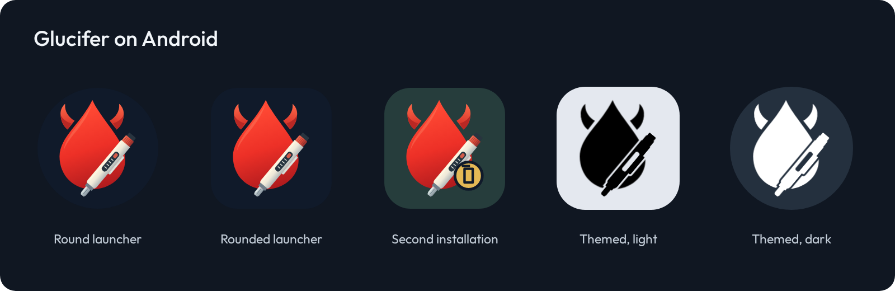

# Glucifer artwork

The horned glucose drop and insulin pen come from [Glucifer for Home Assistant](https://github.com/pannal/glucifer-ha). The editable master is [glucifer.svg](glucifer.svg). The artwork is available under this repository's [GPL-3.0 license](../../LICENSE.txt).


The app uses the mark in its launcher icon. Android can crop the adaptive icon to its launcher shape or tint the monochrome layer for themed icons. The second installation has a separate badge and background. The previews below show these assets with representative masks and colors; they are not device screenshots.



Use [mark.png](mark.png) for a transparent mark, [icon.svg](icon.svg) for a framed icon, and [banner.svg](banner.svg) for the wordmark. Banner lettering uses [Outfit](https://github.com/google/fonts/tree/main/ofl/outfit), included under the [SIL Open Font License](Outfit-OFL.txt).

## Regenerating assets

Edit `glucifer.svg`, then run the renderer with Node.js and Playwright Chromium:

```sh
npm install --prefix /tmp/glucifer-artwork playwright@1.63.0
/tmp/glucifer-artwork/node_modules/.bin/playwright install chromium
NODE_PATH=/tmp/glucifer-artwork/node_modules node docs/brand/render.cjs
```

The renderer reads local files only and writes the banner, previews and Android resources. The monochrome pen has fewer details so it remains legible when tinted. Adaptive foregrounds use a 108 dp layer with the mark centered in its 66 dp safe region, following [Android's icon guidance](https://developer.android.com/develop/ui/compose/system/icon_design_adaptive).
