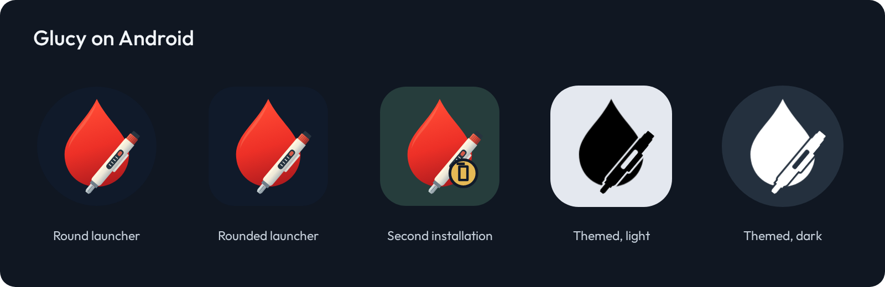

# Glucy artwork proposal

A second naming and artwork option for [PR #276](https://github.com/ctqvva/JugglucoNG/pull/276): Glucy keeps the glucose drop and insulin pen, with the horns removed.


The editable master is [glucy.svg](glucy.svg). The drop stays centered on its own axis, independent of the pen or second-installation badge. These files are proposal assets; they do not replace the app name or installed launcher resources.



The launcher examples show sample masks and theme colors, not device screenshots. Included variants are a [framed icon](icon.svg), [transparent mark](mark.png), [adaptive foreground](adaptive-foreground.svg), [monochrome foreground](monochrome.svg), and separate [badged](duplicate-foreground.svg) and [monochrome badged](duplicate-monochrome.svg) foregrounds. All adaptive variants share the same drop anchor and scale inside the 66 dp safe circle of a 108 dp layer.

Artwork uses the repository's [GPL-3.0 license](../../../LICENSE.txt). The wordmark uses the existing [Outfit font](../Outfit.ttf), under its [SIL Open Font License](../Outfit-OFL.txt).

## Regenerate

With Node.js, Playwright and its Chromium browser installed, run:

```sh
node docs/brand/glucy/render.cjs
```

If Playwright is installed outside the checkout, set `NODE_PATH` to that installation's `node_modules` directory. The renderer reads `glucy.svg` and the shared Outfit font and writes only to this proposal directory.
