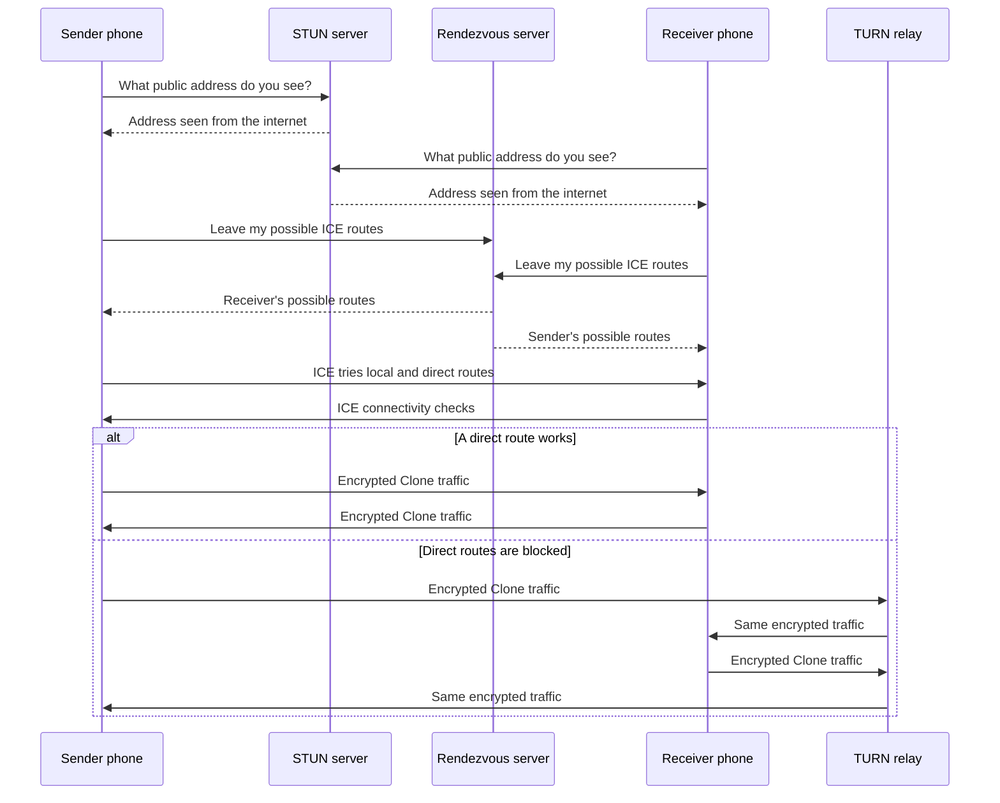

# ICE, STUN, TURN, and rendezvous in plain language

Two phones want to talk, but neither knows where the other phone is right now.
They may be in the same home, on mobile data, behind a router, or moving between
networks. ICE, STUN, TURN, and a rendezvous server work together to find a
usable route.

## The short version

- **STUN:** "What address and port do you see me using?"
- **Rendezvous:** "Here are my possible addresses. Please give them to the
  other phone and give me theirs."
- **ICE:** "Try the possible routes and keep the best one that works."
- **TURN:** "We cannot reach each other directly, so please relay our packets."

STUN and rendezvous help the phones find each other. ICE chooses the route.
TURN carries the traffic only when a direct route does not work.

## A person-to-person analogy

Imagine that you want to talk to another person, but you do not know their
current address.

1. You each ask a STUN receptionist, "What return address do you see on my
   envelope?" The receptionist tells each of you your own public-facing
   address. It does not know where the other person is.
2. You each leave your possible contact addresses at a rendezvous desk. The
   desk introduces you by giving each person the other's list.
3. ICE tries the options. If you are in the same building, you can talk
   directly over the local network. If a direct internet route works, you use
   that instead.
4. If you know each other's addresses but routers or firewalls still prevent a
   direct conversation, you both contact a TURN operator. You send sealed
   envelopes to the operator, and the operator forwards them unchanged to the
   other person.

TURN is therefore closer to a switchboard or forwarding address than a
translator. ICE is the route-finding process, not the language spoken between
the phones.

## What happens on the network

ICE usually considers several candidates:

| Candidate | Meaning | Typical use |
| --- | --- | --- |
| Host | A phone's local address | Both phones are on the same local network |
| Server reflexive | The public address reported by STUN | Direct communication through compatible routers |
| Relay | An address allocated by TURN | Direct communication is blocked |

ICE prefers a working direct route. A local route normally saves mobile data
and avoids an unnecessary relay. TURN is the dependable fallback, not the
first choice.

## Where encryption fits

These services help route the connection; they do not need to read the Clone
payload. A password-protected Clone connection uses authenticated encryption
for its data stream.

- The rendezvous server sees signaling, timing, and candidate IP metadata.
- The STUN server sees the requesting phone's IP address and UDP port.
- The TURN server sees both endpoints, timing, and encrypted packet sizes. It
  forwards the encrypted packets but cannot read the glucose payload.

The Hybrid QR is still sensitive because it contains the Clone connection
password and may also contain TURN credentials. Share it only with the intended
receiver.

## Local QR and Hybrid QR

**Local QR** is for a connection that stays on the same local network. The
phones receive the required details directly from the QR, so internet
rendezvous, STUN, and TURN services are not used.

**Hybrid QR** is for phones that may use different networks. It carries the
settings needed for discovery and fallback. ICE still tries local and direct
routes first, then uses TURN when necessary.

Hybrid does not mean that every reading travels through TURN. The selected
route can change as either phone moves between Wi-Fi and mobile data.

## What each service cannot do

- STUN cannot guarantee that another phone can reach the address it reports.
- Rendezvous does not relay glucose data.
- TURN does not make the application protocol trustworthy by itself. The
  application still needs authentication and encryption.
- ICE cannot prevent a temporary gap during a network change. It detects the
  failed route and negotiates another one.

For setup instructions and a minimal self-hosted deployment, continue with the
[Clone guide](clone.md).
